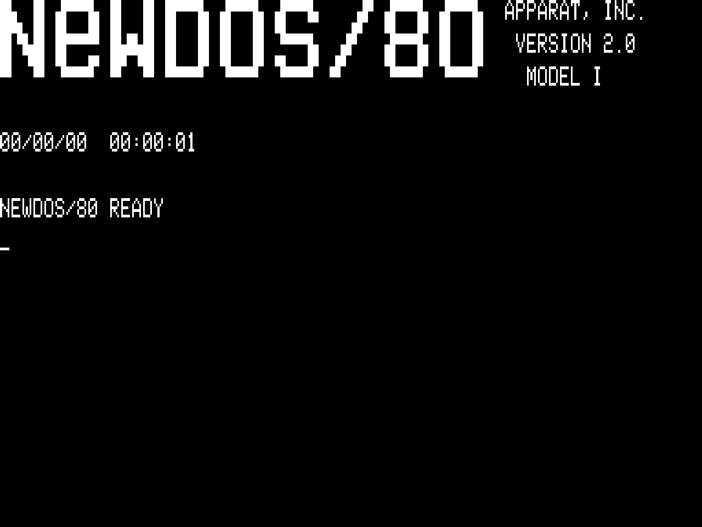
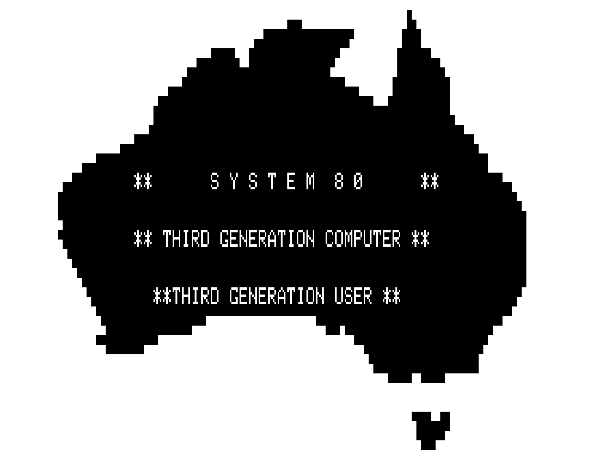

# Dick Smith System 80 (Blue Label) core for MiSTer

An FPGA implementation of the **Dick Smith System 80** for the MiSTer platform,
written from the factory schematics and cross-checked against the technical manual and
Video Genie material.

The System 80 was built by **EACA** in Hong Kong and sold in Australia and New Zealand
by Dick Smith Electronics from 1979. The same machine was sold elsewhere as the
**Video Genie EG-3003**, the **PMC-80** and the **Komtek 1**. While it functioned as a near-perfect TRS-80 Model I clone with high software compatibility, its internal hardware design differed significantly in key areas.

Z80 + 64×16 video + cassette + an X-4020 expansion unit with an **FD1771** and two
drives, in Verilog/SystemVerilog. Everything lives in block RAM - no SDRAM or DDR3 is
used or required.

 
---

## The machine model

**Blue Label System 80.** The fourth and last variant, from 1982, named for its
dark-blue faceplate. Still Mark I lineage - not a Mark II - with three changes that
matter to a core:

- **Lower case fitted as standard.** The video RAM is 8 bits wide which allows for real lowercase glyphs. On a 7-bit Mark I they show as punctuation instead.
- **A 1.5K ROM/EPROM** in the 2K gap between the BASIC interpreter and the start of
  RAM, adding a machine-language monitor, flashing cursor, auto-repeat, screen print
  and key de-bounce. 
- **A built-in amplifier and speaker**, driven from the cassette output port.
  Earlier machines had no AUX output — cassette deck #1 was internal — so owners
  fitted a switch to route sound out through cassette port #2. The Blue Label puts the
  speaker in the case, with no volume control.

Because sound and the cassette share port, **bit 2 mutes the speaker** while the
cassette is running, which is why that bit is the data-path enable and motor
control.

| | |
|---|---|
| **CPU** | Z80 at **1.774083 MHz** — the 10.6445 MHz dot clock ÷ 6 |
| **RAM** | 48K |
| **ROM** | 12K Microsoft Extended BASIC + a 2K EPROM of Blue Label extensions |
| **Video** | 64×16 text, 6×12 character cell, 2×3 block graphics |
| **Refresh** | 50.77 Hz - as shipped in Australia |
| **Sound** | 1-bit loudspeaker |
| **Storage** | Cassette, and an X-4020 expansion unit with an FD1771 and two drives |

### Where the System 80 is not a Model I

This is the part that matters if you know the TRS-80. The Model I memory-maps its
printer, deck select and serial port; **the System 80 puts them on ports.**

| | Model I | System 80 |
|---|---|---|
| Cassette | `$37E4` | port **`$FF`** / **`$FE`** |
| Printer | `$37E8` | port **`$FD`** |
| RS-232 | — | ports **`$F8`** / **`$F9`** |

`$37E4` and `$37E8` are **not decoded at all** here. Port `$FF` bit 2 is motor control
*and* the cassette data-path enable, not motor alone.

The boot prompt is `READY ?`, not the Model I's `MEM SIZE?`.

---

## Core features

### CPU and system

- **Z80 at 1.774083 MHz**, from one PLL. `clk_sys` 42.578 MHz, ÷4 for the 10.6445 MHz
  dot clock, ÷24 for the CPU - so the CPU clock and the character clock are the same
  1.774 MHz signal, exactly as on the machine.
- **48K of RAM** and the full 14K ROM window, all in block RAM.
- **A 40 Hz heartbeat interrupt** derived from the expansion unit, which is what the DOS uses
  to keep time and to wake from `HALT`. Without it NEWDOS/80 reaches `READY` and then
  sits on `HALT`.
  
### Video

- **64×16 text** from the real counter chain - 112 character times per line of which
  64 are displayed, 12 scan lines per row, 312 lines per frame at 50.77 Hz.
- **The character generator.** A dump of the 52116 in the Z25 socket.
- **2×3 block graphics**, the machine's only graphics mode.
- **"Snow"** - the display blanks while the CPU touches video RAM, which is why a real
  System 80 flickers while BASIC scrolls. Modeled, on by default, switchable. See
  below.
- **Three phosphors** - green, amber, white.

### Keyboard

- The real **8×8 wired-OR matrix**, decoded on address lines the way
  the machine does, so software that reads the matrix directly works.
- **Two modes.** *Symbolic* (the default) makes the PC keycap tell the truth, so
  Shift+2 gives `@`. *Positional* drives the machine key in the same physical place
  and lets the ROM decide, so Shift+2 gives `"` — which is what the System 80 does,
  and what matrix-reading software wants.
- **The MkII keypad's function keys**, optional and **off by default** — see
  *Function keys* below.

### Disk

- **FD1771**, single density
- **Two drives**, addressed as `:0` and `:1`.
- **JV1 and DMK containers**, both auto-detected at mount. DMK detection is a size
  signature.
- **JV1 is read/write. DMK is read-only** - see *Known limitations*.

### Cassette

- **`.cas` files**, a raw MSB-first bitstream, played through the real transport
  timing.
- **Rewind** from the OSD, because a load leaves the tape where the ROM stopped it.

### Peripherals

- **Printer at `$FD`** and **RS-232 at `$F8`/`$F9`** are decoded and answer with
  deliberate idle values - printer ready, nothing waiting. Neither is functional;
  the tie-offs exist so `LPRINT` does not hang on a busy printer that never clears.

---

## OSD options

| Option | What it does |
|---|---|
| **Mount Drive 0:** | `.dsk`, `.jv1`, `.dmk` |
| **Mount Drive 1:** | the same, for the second drive |
| **Load Tape** | `.cas` |
| **Rewind Tape** | Returns the tape to the start |
| **Phosphor** | Green / Amber / White |
| **Snow** | On / Off - **On** by default |
| **Keyboard** | Symbolic / Positional |
| **Aspect ratio** | Original / Full Screen / custom |
| **Scandoubler Fx** | None / HQ2x / CRT 25% / CRT 50% |
| **Scale** | Normal / V-Integer / HV-Integer variants |
| **Reset** | Restarts the machine |


### About Snow

Real hardware blanks the display while the CPU touches video RAM. From the technical
manual:

> the display is blanked during the CPU's access to the video RAM because VID sets the
> data/control latch Z3 and Z26 to the CLEAR state through Z40-6

This option can be disabled if desired.

**Turn it off before diagnosing any video problem.** 

---

## Installing on MiSTer

The core name is **`System80`**, which is what MiSTer uses to find everything.

```
/media/fat/_Computer/System80_YYYYMMDD.rbf
/media/fat/games/System80/
        *.dsk  *.jv1  *.dmk  *.cas
```

---

## Disk images

| Format | Extension | Notes |
|---|---|---|
| **JV1** | `.dsk`, `.jv1` | Raw sectors, 10 × 256 per track. The common TRS-80 format. **Read/write** |
| **DMK** | `.dsk`, `.dmk` | Track images with real IDAM tables and address marks. **Read-only** |

Both are detected automatically at mount - the extension does not decide, the contents
do. Many System 80 images are DMK inside a file named `.dsk`, which is handled.

**Side 1 is ignored.** DMK images frequently declare two sides while every side-1 track
image is empty, and the FD1771 bus has no side-select line in any case.

---

## Known limitations

- **DMK images are read-only.** A correct FM write has to update both copies of every
  doubled byte, and it would sit on a write path that is not yet exercised. JV1 writes
  are available.
- **Disk writes not tested** - the write path exists but has not been
  verified. Back up disk images before trusting it.
- **The printer and RS-232 ports are tie-offs**, not implementations.

---

## Keyboard reference

Default is **Symbolic**, which assumes a **US layout**. In **Positional** mode you get
the System 80's own layout, where the ROM decides the character:

| You press | Positional gives | | You press | Positional gives |
|---|---|---|---|---|
| Shift+`2` | `"` | | Shift+`7` | `'` |
| Shift+`6` | `&` | | Shift+`8` | `(` |
| `` ` `` | `@` | | Shift+`9` | `)` |
| `'` | `:` | | Shift+`-` | `=` |

Letters, digits, Space, Enter, Break, Clear, Backspace and the cursor keys are
identical in both modes.

| PC key | System 80 |
|---|---|
| `Esc` | **BREAK** |
| `Home` | **CLEAR** |
| `Backspace` | `←`, as on the machine |
| arrow keys | cursor keys |

### Function keys

There are two different F1 keys on this machine, and only one of them is a
key at all.

- **The front-panel `F1`** is a *locked switch*, not a matrix key. From the manual: "There
  are two locked switches, F1 and PAGE, which are not included in the key matrix. They
  directly control the hardware of the resident cassette recorder and the display modes
  respectively." Software cannot read it.
- **The four programmable function keys** are on the **MkII numeric keypad**. The Blue Label has no keypad, so nothing on
  a real Blue Label drives them.

**F1–F12 do nothing by default, and that is faithful rather than missing.**

Some MkII-era software requires them - WORP-9's work-disk procedure wants
`<F1>`. A real Blue Label cannot complete that procedure either, for the same reason:
no keypad, no function keys.

**"MkII Func Keys" in the OSD** puts PC **F1–F4** on those keypad positions. 
It is **Disabled** by default on purpose: enabling it makes the core do something the machine it models cannot, 
so the authentic machine is what you get by default. When enabled the ROM reports the four keys as the
characters `[`, `\`, `]` and `^` - that is the machine's own keyboard decode,and the MkII ROM behaves identically.

Six PC combinations are unreachable in symbolic mode - `` ` `` `~` `[` `]` `\` `{` `}`
`|` `^` `_` - because no System 80 key produces those characters at all. They do
nothing, deliberately.

---

## Credits and attributions

### Core development

- **Diego Viso** ([@diegov-au](https://github.com/diegov-au)) - core development, hardware testing and verification.

### Special Thanks

- **Terry Stewart** ([Classic Computers](https://www.classic-computers.org.nz/)) -
  without whom this core would not exist in the form it does. Terry maintains the most
  complete System 80 archive anywhere, and **every piece of technical documentation and
  software used in this project came from his site**: the technical manual, the factory
  schematics, and the disk and tape library. He also answered questions
  by email throughout - on how the machine actually works, and on which ROM is which -
  and that firsthand knowledge settled things no document could.


### Hardware sources

The EACA **factory schematics** and the **System 80 Technical Manual** are the primary
sources for the memory map, the video hardware, the port assignments and the X-4020
expansion unit. They are the only sources in the project that are not somebody else's
reading of the hardware.

**Video Genie material counts as primary.** The EG-3003 is the same EACA machine under
another name, so a Genie dump is the machine rather than an interpretation of it.


### Framework and vendored cores

- **[MiSTer](https://github.com/MiSTer-devel/Main_MiSTer)** framework (`sys/`) by
  **Alexey Melnikov (Sorgelig)**, **Till Harbaum** and the MiSTer-devel community —
  HPS interface, video scaling, audio output and the OSD.
- **[tv80](https://github.com/hutch31/tv80)** by **Guy Hutchison** — the Z80 CPU core
  (MIT).
- **`fd1771.sv`** — descended from the WD1793 controller in the MiSTer-devel ecosystem,
  by way of this project's MicroBee core. Reduced to a real FD1771 here: the MFM and
  side-select paths are deleted rather than left unreachable, and a DMK container
  parser was added.

---

## Licence

**GPL-2.0**, matching the MiSTer framework in `sys/` and the vendored floppy
controller. The `tv80` CPU core is MIT.


---

This core was developed with AI assistance. The RTL, the simulation harness and the
documentation were written collaboratively with Claude, with every hardware behaviour
verified against the factory schematics, the technical manual, and a real DE10-Nano.
